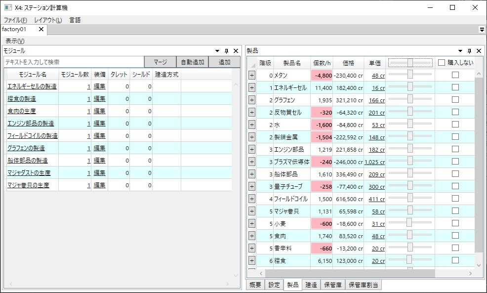

# X4: Foundations ステーション計算機

# Other languages
- [English](./readme.md)

# 目次
<!-- TOC depthFrom:2 -->

- [1. 概要](#1-概要)
- [2. 主な機能/特徴](#2-主な機能特徴)
- [3. 動作確認環境](#3-動作確認環境)
- [4. 導入方法](#4-導入方法)
- [5. 使用方法](#5-使用方法)
- [6. アンインストール方法](#6-アンインストール方法)
- [7. ライセンス](#7-ライセンス)
- [8. 謝辞](#8-謝辞)
- [9. 使用ライブラリ](#9-使用ライブラリ)

<!-- /TOC -->

## 1. 概要
本アプリケーションは [Egosoft](http://www.egosoft.com/) 社より発売しているゲーム [X4: Foundations](http://www.egosoft.com/games/x4/info_jp.php) 向けのステーション計算機です。  
 

## 2. 主な機能/特徴
1. ゲームファイルよりデータを直接抽出
    1. Modのサポート
    1. 今後のバージョンアップへの対応
    1. 抽出したデータの閲覧機能
1. ステーション全体の製品/必要資源の計算
1. モジュールの兵装も考慮したステーションの建造に必要なウェアの計算
1. 保管庫のウェア割当容量計算
1. 多言語対応  
 

## 3. 動作確認環境
- Windows10 64bit Version 1903
- .NET Core 3.1  
 

## 4. 導入方法
[Release](https://github.com/Ocelot1210/X4_ComplexCalculator/releases) から最新の実行環境をダウンロード下さい。  
 

## 5. 使用方法
[Wiki](https://github.com/Ocelot1210/X4_ComplexCalculator/wiki) をご参照下さい。  
 

## 6. アンインストール方法
レジストリは一切編集していないのでフォルダごと削除してください。  
 

## 7. ライセンス
X4 Complex Calclator は [Apache License 2.0](https://github.com/Ocelot1210/X4_ComplexCalculator/blob/master/LICENSE) ライセンスにて提供されています。  
貢献を歓迎いたします！
 

## 8. 謝辞
| リポジトリ | 説明 |
| --- | --- |
| [X4FProjector](https://github.com/bno1/X4FProjector) | X4よりデータを抽出する処理を参考にさせて頂きました。 |
 

## 9. 使用ライブラリ
- [.NET Extensions](https://github.com/dotnet/extensions)
- [AvalonDock](https://github.com/Dirkster99/AvalonDock)
- [Coverlet](https://github.com/coverlet-coverage/coverlet)
- [Dapper](https://github.com/StackExchange/Dapper)
- [DataGridExtensions](https://github.com/dotnet/DataGridExtensions)
- [GitInfo](https://github.com/devlooped/GitInfo)
- [GongSolutions.WPF.DragDrop](https://github.com/punker76/gong-wpf-dragdrop)
- [ImageSharp](https://github.com/SixLabors/ImageSharp)
- [Json.NET](https://github.com/JamesNK/Newtonsoft.Json)
- [Microsoft.Extensions.Configuration](https://github.com/dotnet/runtime)
- [Microsoft.NET.Test.Sdk](https://github.com/microsoft/vstest/)
- [Microsoft.Xaml.Behaviors.Wpf](https://github.com/microsoft/XamlBehaviorsWpf)
- [Onova](https://github.com/Tyrrrz/Onova)
- [Pfim](https://github.com/nickbabcock/Pfim)
- [Prism](https://github.com/PrismLibrary/Prism)
- [ReactiveProperty](https://github.com/runceel/ReactiveProperty)
- [System.Data.SQLite.Core](https://system.data.sqlite.org/index.html/doc/trunk/www/index.wiki)
- [Throttle.Fody](https://github.com/tom-englert/Throttle.Fody)
- [Windows-API-Code-Pack-1.1.4](https://github.com/contre/Windows-API-Code-Pack-1.1)
- [WpfExToolkit](https://github.com/dotnetprojects/WpfExtendedToolkit)
- [WpfLocalizeExtension](https://github.com/XAMLMarkupExtensions/WPFLocalizationExtension/)
- [XamlBehaviors for WPF](https://github.com/Microsoft/XamlBehaviorsWpf)
- [xUnit](https://github.com/xunit/xunit)
- [xunit.runner.visualstudio](https://github.com/xunit/visualstudio.xunit)