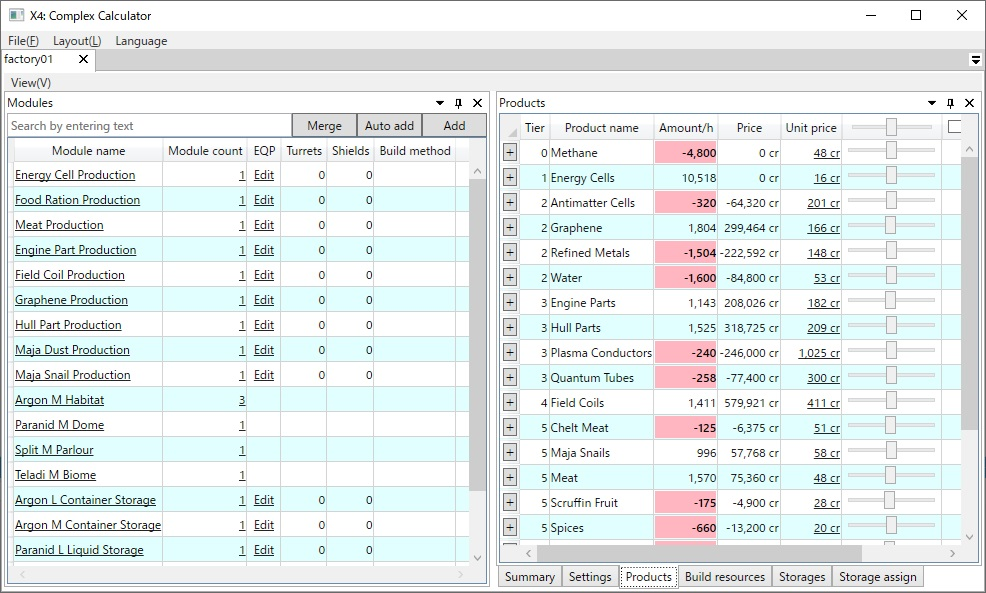

# X4: Foundations Complex Calculator

# Other languages
- [日本語](./readme.ja.md)

# Table of contents
<!-- TOC depthFrom:2 -->

- [1. Summary](#1-summary)
- [2. Main features](#2-main-features)
- [3. Tested environment](#3-tested-environment)
- [4. How to install](#4-how-to-install)
- [5. How to use](#5-how-to-use)
- [6. How to Uninstall](#6-how-to-uninstall)
- [7. Licenses](#7-licenses)
- [8. Acknowledgment](#8-acknowledgment)
- [9. Used libraries](#9-used-libraries)

<!-- /TOC -->

## 1. Summary
This application is a station calculator for the game [X4: Foundations](http://www.egosoft.com/games/x4/info_en.php) from [Egosoft](http://www.egosoft.com/).  
 

## 2. Main features
1. Direct data extraction from game files.
    1. Support mods.
    1. Support for future versions.
1. Calculation of product/resource for the entire station.
1. Calculation of the ware required for construction, taking into account the armament.
1. Storage allocation capacity calculation.
1. Support multilingual.  
 

## 3. Tested environment
- Windows10 64bit Version 1903
- .NET Core 3.1  
 

## 4. How to install
Please download from [Release](https://github.com/Ocelot1210/X4_ComplexCalculator/releases) page.  
 

## 5. How to use
Please refer to [Wiki](https://github.com/Ocelot1210/X4_ComplexCalculator/wiki).
 

## 6. How to Uninstall
The registry is not edited at all, so please delete the entire folder.  
 

## 7. Licenses
X4 Complex Calclator is licensed under the [Apache License 2.0](https://github.com/Ocelot1210/X4_ComplexCalculator/blob/master/LICENSE).   
Contributions are welcomed!  
 

## 8. Acknowledgment
| Repository | Description |
| --- | --- |
| [X4FProjector](https://github.com/bno1/X4FProjector) | I was allowed to reference data export processing from X4. |
 

## 9. Used libraries
- [Dapper](https://github.com/StackExchange/Dapper)
- [AvalonDock](https://github.com/Dirkster99/AvalonDock)
- [WpfExToolkit](https://github.com/dotnetprojects/WpfExtendedToolkit)
- [GongSolutions.WPF.DragDrop](https://github.com/punker76/gong-wpf-dragdrop)
- [.NET Extensions](https://github.com/dotnet/extensions)
- [Windows-API-Code-Pack-1.1.4](https://github.com/contre/Windows-API-Code-Pack-1.1)
- [XamlBehaviors for WPF](https://github.com/Microsoft/XamlBehaviorsWpf)
- [Json.NET](https://github.com/JamesNK/Newtonsoft.Json)
- [Prism](https://github.com/PrismLibrary/Prism)
- [ReactiveProperty](https://github.com/runceel/ReactiveProperty)
- [System.Data.SQLite.Core](https://system.data.sqlite.org/index.html/doc/trunk/www/index.wiki)
- [WpfLocalizeExtension](https://github.com/XAMLMarkupExtensions/WPFLocalizationExtension/)